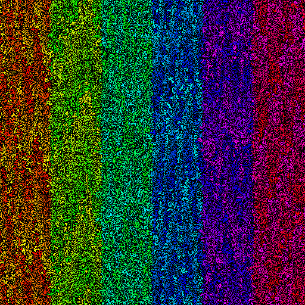

# ASPP CUDA programming coursework

Please see Learn for submission deadlines.

Remember what you submit must be your own work. Anything not your own
work which you have accessed should be correctly referenced and
cited. You must not share this assessment's source code nor your
solutions. Use of generative AI tools, in line with School policy, is
not permitted.

Please see further information and guidance from the School of
Informatics Academic Misconduct Officer:
<https://web.inf.ed.ac.uk/infweb/admin/policies/academic-misconduct>

## Summary

Your goal here is to take a naïve, serial code that runs a percolation
model, and make this run correctly and efficiently using a single GPU
on Cirrus (i.e. one NVIDIA V100).

You must also prepare a brief report (maximum 1 page) explaining, with
reference to the algorithm and hardware, how the changes you have made
to the code achieve this performance.

As part of marking, your code will be compiled and run on Cirrus using
the `gpu` partition, so please use that for any tuning and profiling
you do.

It is **ABSOLUTELY ESSENTIAL** that you name your submitted source file as
`$EXAMNUMBER.cu`, for example `B654321.cu` and this must match the
submitted report. Your code will be compiled and run
automatically. Deviating from this is likely to result in a mark of
zero for correctness and performance.

Expected time to complete: 5 hours

## Problem description

So called "percolation models" are used as simplified models of
various systems, including forest fires, disease propagation, and flow
in porous media. Here we focus on the latter, asking: given a random
lattice 2D material with a porosity `p` (i.e. the material is
approximated as a grid of equal sized squares, each being empty with
independent probability `p`), do the pore spaces connect?

This can be done by first labelling each non-solid cell with a unique
number, then iteratively updating this value to the maximum of the
labels at that cell and its four immediate neighbours, i.e.

```
new_label[i,j] = max(
                label[  i,j+1],
label[i-1,  j], label[  i,  j], label[i+1, j]
                label[  i,j-1]
)
```

To know when to finish, the algorithm needs to know when this process
has converged, i.e. when the total number of changes across the whole
grid is zero.

The supplied code applies this, in serial, on the CPU. The driver code
runs this once on the CPU to compute a reference solution, then a
number of times using the GPU implementation (in the initial code,
this is simply a copy of the CPU implementation with an altered
function name), before validating the solution, printing timing
statistics, and writing the a image of the output.



It accepts the following flags:

`-M <integer>` - horizontal size of grid (default 512)

`-N <integer>` - vertical size of grid (default 512)

`-S <integer>` - random seed (default 1234)

`-r <integer>` - number of repeats for benchmarking (default 3)

`-p <float>` - target porosity between 0 and 1 (default 0.4)

`-o <path>` - file name to write output PNG image (default `test.png`)

## Set up
On Cirrus:

1. Clone the code repository (recalling that only the work filesystem is accessible from the compute nodes): `git clone /home/z04/shared/aspp/cw1`

2. Load the required modules: `module load cmake gcc/10.2.0 nvidia/nvhpc/24.5`

3. Configure the code. For the marking runs, I will use a build type
   of `Release`, but you may prefer to build with some debug info
   while testing. You can put the build directory where you like, but
   the included scripts expect it to be in `$repo/build`

```bash
cmake -S src -B build \
  -DCMAKE_BUILD_TYPE=RelWithDebInfo \
  -DCMAKE_CUDA_ARCHITECTURES=70-real
```

4. Compile: `cmake --build build -j 4`. This will produce an
   executable `test`.

5. Running the *unmodified* code is possible on the login nodes. If
   you run with no options (just `build/test`) the produced image
   should be identical to the `default_output.png` in the root of the
   repository.
   
6. I have provided several template batch scripts, one (`run.sh`)
   simply runs the executable while the other two profile it.

## Requirements for your code

You must adapt the code so that it runs on one GPU, correctly and with
good performance.

Your code will form part of the submission and is worth 50% of the
marks for this assignment. You may only submit your changed version of
`perc_gpu.cu`. It is **ESSENTIAL** that you name the submitted file
`YOUR EXAM NUMBER.cu` (the one that starts with a "B"). Calling it
anything else may make the test fail and make it impossible to match
up with your report. This submitted file will be added to a copy of
the supplied repository for benchmarking.

Your code must compile (with only the modules given above loaded) by
running `cmake` as above (with `CMAKE_BUILD_TYPE=Release`) and run
with the existing command line options. Note that a code that does not
compile is, by definition incorrect, and that a code that produces
incorrect results scores no points for performance.

You may use functions and types from the standard library and base
CUDA library, but from no other sources.

**To be sure your code works, please test it on Cirrus and submit that
version, correctly named!**

**Clarity**: your modifications will be marked for usual good practice
in programming. Are variables/functions sensibly named? Code well
formatted? Are comments present, where necessary, to explain what is
not obvious?

**Correctness**: the benchmark code compares the GPU results to those
from the (unmodified) serial CPU version. I will compile and run this
against a range of problem sizes and porosities.

**Performance**: I will use several problems of different sizes and
porosities, taking the best performance run in each case. Sizes will
be between 128 and 16,384 inclusive along *each* dimension.

## Requirements for report

This must be a PDF with a maximum of one A4 page and text at 10pt or
greater.

1. Why is this problem more complex to solve on a GPU than a single
   core? (2-3 sentences) [10 %]

2. Explain the choices that you have made to get good performance and
   how you arrived at them, with reference to *both* the hardware and
   the problem to solve.  You may choose to refer to your code
   (e.g. see lines 90--95). [30 %]

3. What level of performance might be achievable and how close have
   you got to it? [10%]

## Submission

Please see the instructions on Learn for full details, but you will
have to submit the code and report to separate queues.

**It is VITAL that you use your exam number for both the code and
report filenames so we can match them up!** I.e., the report should be
`B123456.pdf` and the code `B123456.cu`.

## Hints

You have been provided the code in a version controlled Git
repository. I suggest that you make use of it to track your progress
and you will be able to tell if you have inadvertently modified files
that you should not with `git status`.

I highly recommend starting with a look at the existing code and
thinking about point 1 from the report. Consider how you will
decompose the index space between blocks and threads and how you will
decide when to terminate.

You should test with a variety of problem sizes.

You may wish to get interactive access to a GPU if you are doing
debugging/performance tuning. Use this SLURM command:
```
srun --partition=gpu --qos=short --gres=gpu:1 \
     --time=0:10:0 --account=$BUDGETCODE --pty /usr/bin/bash --login
```
(replacing `$BUDGETCODE` with your budget).

I note that running extra iterations should not change the result, but
that this will take more time.
